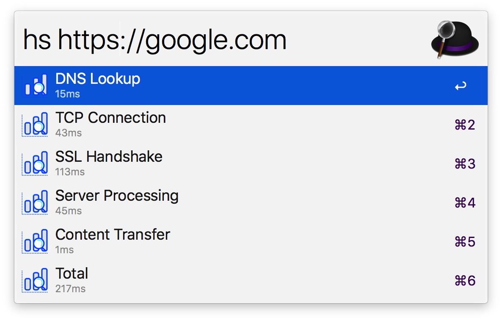

# arvis-httpstat

</img>

## Install

```
$ npm install --global arvis-httpstat
```

## Usage

In arvis, type `hs`, <kbd>Enter</kbd>, and your URL query.


## License

MIT © [leozhang2018](http://code.leozhang2018.me)
